# **Documentación ARSW Laboratorio 8 - Terraform**

**Creado por**

Juan Carlos Leal Cruz

## **Generalidades del Lab**
### **Prerequisitos**

- Azure CLI instalado y sesión activa: `az login && az account show`
- Terraform >= 1.6: `terraform --version`
- Clave SSH generada: `ssh-keygen -t ed25519 -C "lab8-arsw"`
- Repositorio GitHub creado para el equipo
  
### **Estructura del repositorio**

```
ARSW_Lab8_Terraform
├── github/ workflows/
│   └── terraform.yml        # Plan en PRs · apply/destroy manual OIDC
├── infra/
│   ├── bootstrap/           # Usado para crear el Storage Account del state
│   │   ├── providers.tf     # State local, ejecutar una sola vez
│   │   ├── variables.tf
│   │   ├── main.tf          # RG + Storage Account + Container
│   │   └── outputs.tf       # Imprime el bloque backend.hcl listo
│   ├── main.tf              # Infraestructura principal
│   ├── providers.tf
│   ├── variables.tf
│   ├── outputs.tf
│   ├── cloud-init.yaml
│   ├── backend.hcl.example
│   └── env/
│       └── dev.example.tfvars    # Archivo de ejemplo para el dev.tfvars de producción
├── modules/
    ├── vnet/                # VNet + subnet-web + subnet-mgmt
    ├── compute/             # NICs + VMs Ubuntu 22.04 LTS
    └── lb/                  # LB Standard + backend pool + health probe + NSG
```

## **Parte 1. Creación del Storage Account**
En este paso se crea el Storage Account en Azure con Terraform haciendo uso del state local. Solo se debe ejecutar una vez, por lo cual no es necesario volver a usar el comando `apply` por segunda vez para esta fase.

### **Paso a Paso**
1. Autenticarse dentro del CLI de Azure
   ```bash
   az login
   az account show
   ```
2. Ingresar a la carpeta con los archivos
   ```bash
   cd infra/bootstrap
   ```
3. Inicializar terraform y crear las primeras instancias
   ```bash
   terraform init    # sin backend — usa estado local
   terraform apply   # crea RG + Storage Account + Container
   ```
4. Obtener la configuración del backend
   ```bash
   terraform output backend_hcl_block
   ```

Los anteriores comandos generan un output que se ve tal como el archivo de ejemplo `backend.hcl.example` y ese contenido resultante es el que se debe de pegar dentro del archivo `backend.hcl`, el cual permite que Terraform almacene su estado de forma remota en Azure, facilitando el trabajo colaborativo y evitando inconsistencias.

**Importante ❗️** El archivo `backend.hcl` es privado y se mantiene unicamente en local y no debe de subirse al repo.

## **Parte 2. Configuración de OIDC en Azure para Github Actions**
GitHub Actions usa federación de identidades OIDC para autenticarse en Azure sin guardar contraseñas. Necesitas dos subjects: uno para pushes a `main` y otro para PRs.

### **Obtención de los secretos**
1. Editar el shell nombrado como `setup-oidc.sh` ya que este contiene el código que sirve para autenticar Azure
   ```bash
   # 1. Crear App Registration
   APP_ID=$(az ad app create --display-name "github-lab8-oidc" --query appId -o tsv)
   SP_ID=$(az ad sp create --id $APP_ID --query id -o tsv)

   # 2. Rol Contributor sobre el RG del lab (principio de mínimo privilegio)
   az role assignment create \
    --role "Contributor" \
    --assignee $APP_ID \
    --scope "/subscriptions/$SUB"

   # 3a. Subject para push a main
   az ad app federated-credential create --id $APP_ID --parameters "{
    \"name\": \"github-main\",
    \"issuer\": \"https://token.actions.githubusercontent.com\",
    \"subject\": \"repo:${ORG}/${REPO}:ref:refs/heads/main\",
    \"audiences\": [\"api://AzureADTokenExchange\"]
   }"

   # 3b. Subject para pull_request (plan en PRs)
   az ad app federated-credential create --id $APP_ID --parameters "{
    \"name\": \"github-pr\",
    \"issuer\": \"https://token.actions.githubusercontent.com\",
    \"subject\": \"repo:${ORG}/${REPO}:pull_request\",
    \"audiences\": [\"api://AzureADTokenExchange\"]
   }"

   # 3c. Subject para workflow_dispatch (apply / destroy manual)
   az ad app federated-credential create --id $APP_ID --parameters "{
    \"name\": \"github-dispatch\",
    \"issuer\": \"https://token.actions.githubusercontent.com\",
    \"subject\": \"repo:${ORG}/${REPO}:ref:refs/heads/main\",
    \"audiences\": [\"api://AzureADTokenExchange\"]
   }"
   ```
2. Se deben de editar las siguientes variables dentro del shell
   ```bash
   ORG="Usuario-git"  #Cambia esto por tu organización o usuario de GitHub
   REPO="Nombre-del-repositorio"  #Cambia esto por el nombre de tu repositorio
   ```
3. Luego se procede a darle permisos al archivo
   ```bash
   chmod +x setup-oidc.sh
   ```
4. Finalmente se ejecuta el script
   ```bash
   ./setup-oidc.sh
   ```

   El resultado se debe de ver algo como esto:
   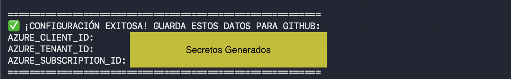

### **Configuración de los Secretos**
Para configurar los secertos se debe de ingresar primero al repositorio en Github, luego moverse a la configuración. Una vez allí nos dirigimos a la sección de secretos y le damos click en "Añadir un nuevo secreto". En total debemos tener 7 secretos los cuales son:
| Secret | Valor |
|---|---|
| `AZURE_CLIENT_ID` | `$APP_ID` del paso anterior |
| `AZURE_TENANT_ID` | `$TENANT` |
| `AZURE_SUBSCRIPTION_ID` | `$SUB` |
| `TF_STATE_RG` | `rg-tfstate-lab8` |
| `TF_STATE_SA` | nombre del Storage Account (output del bootstrap) |
| `SSH_PUBLIC_KEY` | contenido de `~/.ssh/id_ed25519.pub` |
| `ALLOW_SSH_CIDR` | tu IP pública en formato `X.X.X.X/32` |

**Importante ❗️** Para la ip se puede hacer uso del comando `curl ifconfig.me` y para la clave ssh, se debe usar el comando `cat ~/.ssh/id_ed25519.pub` y copiar todo el contenido del archivo.

Al finalizar la configuración, GitHub se debe de ver así:
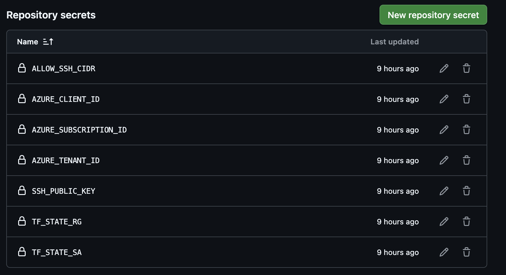

### **Configuración del Environment con aprobación manual**
Ve a **Settings → Environments → New environment** → nombre: `production` → activa **Required reviewers** y agrega tu usuario. Los jobs `apply` y `destroy` esperarán aprobación explícita.

## **Parte 3. Desplegar la infraestructura principal**
En esta etapa se despliega la infraestructura definida en Terraform utilizando el backend remoto previamente configurado.

### **Paso a Paso**
1. Ubicarse en el directorio de infraestructura
   ```bash
   cd infra
   ```
2. Configurar variables de entorno. Se debe de editar el archivo `env/dev.tfvars`basado en el ejemplo que se encuentra en el repo. por lo cual se debe de ajustar:
   - `owner`: Tu alias o identificador
   - `allow_ssh_from_cidr`: Tu dirección IP pública
3. Inicializar Terraform con backend remoto
   ```bash
   terraform init -backend-config=backend.hcl
   ```
4. Formatear y validar la configuración
   ```bash
   terraform fmt -recursive
   terraform validate
   ```
5. Generar el plan de ejecución
   ```bash
   terraform plan -var-file=env/dev.tfvars -out plan.tfplan
   ```
6. Aplicar la nueva infraestructura
   ```bash
   terraform apply "plan.tfplan"
   ```

Como resultado se espera que al finalizar, se desplegarán:
- Máquinas virtuales Linux (Ubuntu)
- Interfaces de red
- Balanceador de carga
- Reglas de acceso (NSG)

Toda la infraestructura quedará registrada en el estado remoto de Terraform. Se puede tener como ejemplo la siguiente imagen:
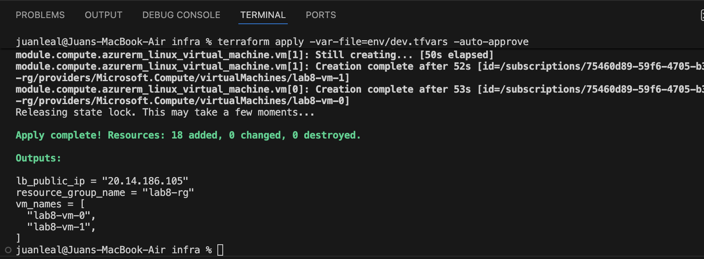

## **Parte 4. Validar el Load Balancer**
Una vez desplegada la infraestructura, podemos verificar que el Load Balancer (LB) esté funcionando correctamente y balanceando las solicitudes entre las VMs. Lo anterior lo realizamos a través del archivo localizado dentro de infra que se llama `validar_lb.sh`, el cual es un script que se encarga de hace un curl con una petición de la IP que se nos fue suministrada al final de correr `terraform apply ...`

### **Paso a Paso**
1. Ubicarse en el directorio de infraestructura
   ```bash
   cd infra
   ```
2. Dar permisos al archivo
   ```bash
   chmod +x validar_lb.sh
   ```
3. Ejecutar el script
   ```bash
   ./validar_lb.sh
   ```

Como salida esperada tenemos el siguiente resultado:
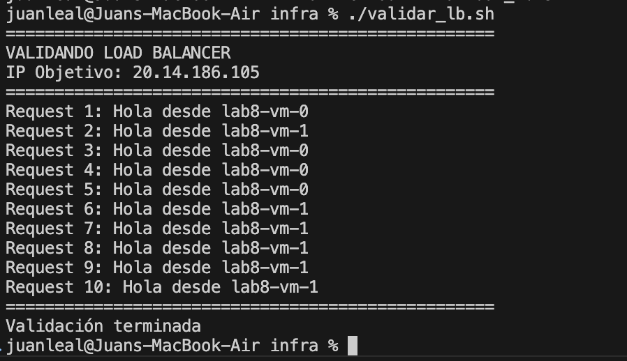

De igual forma si se quiere evidenciar de forma más clara y de primera mano, se puede ingresar a la dirección `http://<IP_Resultado_Parte_3>`:
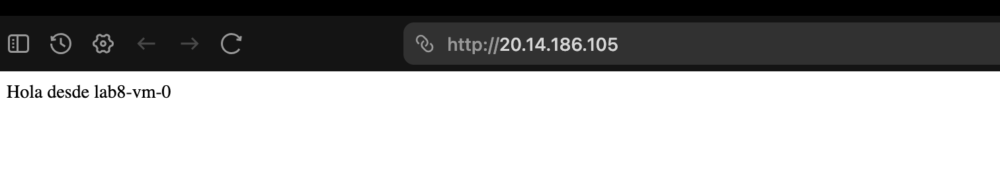
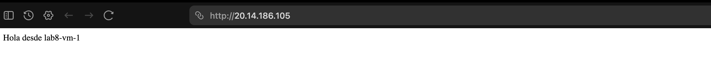


## **Parte 5. Pipeline CI/CD — comportamiento esperado**

| Evento | Jobs que corren |
|---|---|
| Pull Request a main | `plan` → publica resultado como comentario + artefacto |
| Push a main | `plan` → valida que main siempre esté en verde |
| workflow_dispatch plan | `plan` |
| workflow_dispatch apply | `apply` (requiere aprobación en Environment production) |
| workflow_dispatch destroy | `destroy` (requiere aprobación en Environment production) |

Como primera evidencia podemos observar el comprotamiento al correr el job `Terraform plan`, el cual evita hacer `apply` y `destroy` debido a la configuración que usamos dentro del `terraform.yml`:
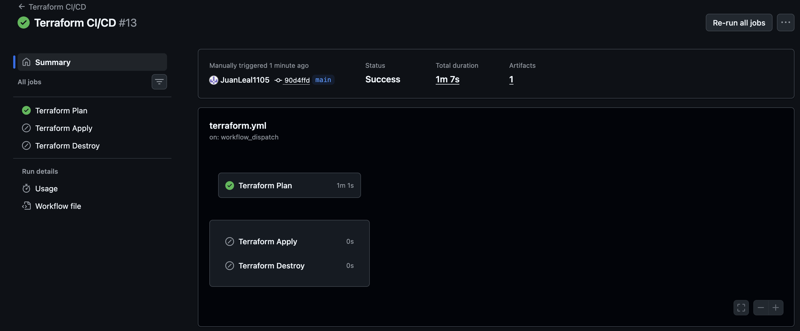

## **Parte 6. Limpieza (obligatorio)**
Al finalizar el laboratorio, es importante destruir toda la infraestructura para evitar cargos innecesarios en Azure y dejar el entorno limpio.

### **Paso a Paso**
1. Destruir la infraestructura principal
   ```bash
   cd infra
   terraform destroy -var-file=env/dev.tfvars
   ```
   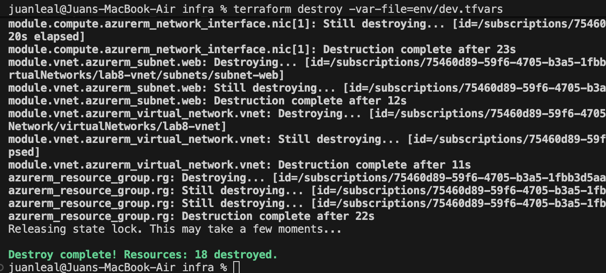

2. Verificar que el Resource Group se eliminó
   ```bash
   az group show -n lab8-rg
   ```
   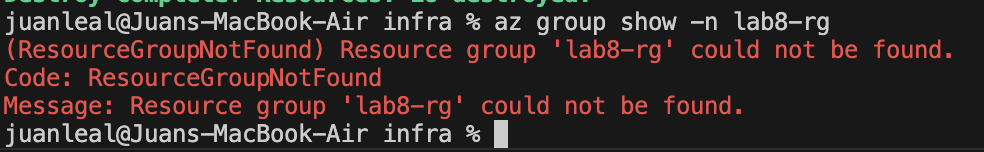

3. (Opcional) Destruir el backend de Terraform
   ```bash
   cd infra/bootstrap
   terraform destroy
   ```
   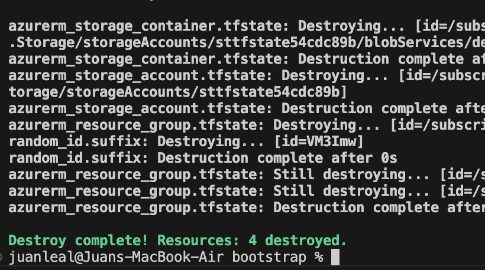
   

Otra alternativa completamente válida es hacerlo desde GitHub Actions: Actions, luego Terraform CI/CD y damos click en Run workflow y seleccionamos destroy. Lo anterior requiere aprobación debido a cómo configuramos el ambiente en la Parte 2 de este lab.
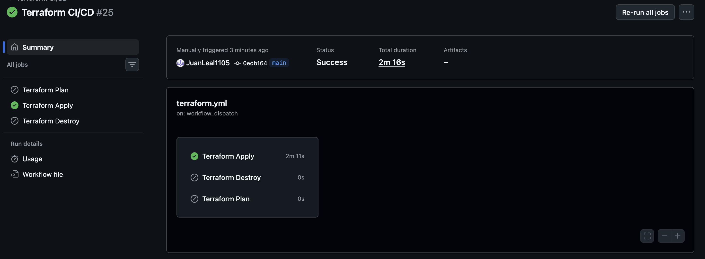
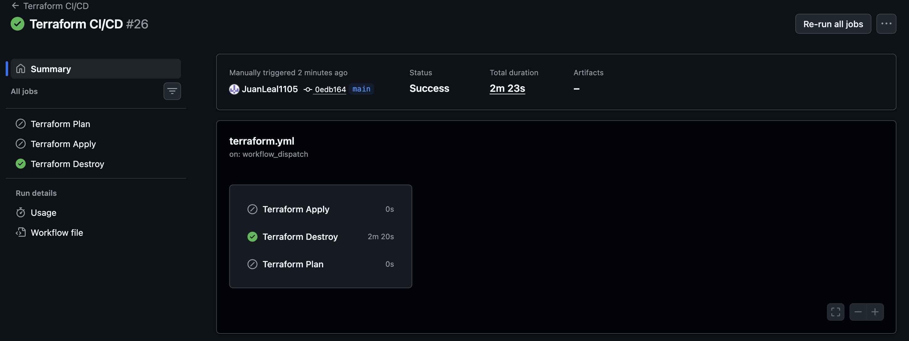

**Nota Importante ❗️**
El despliegue en el ambiente de producción no se pudo realizar y por eso tanto `apply` como `destroy` estan dentro del mismo "contenedor" que `plan`, ya que al intentar registrar la app dentro de Azure me encontré con permiso denegado debido a que mi organización me había bloqueado la posibildiad de acceder a la opción de registros.

## Retos implementados
### Reto 1 — Azure Bastion
Azure Bastion permite acceso SSH a las VMs sin exponer el puerto 22 a Internet.
En lugar de una IP pública por VM, el acceso se hace a través del portal de Azure
usando el Bastion Host como intermediario seguro.
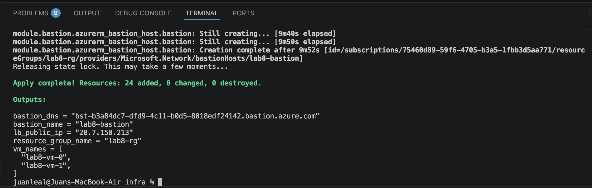

#### **Recursos creados:**
- `azurerm_public_ip` — IP pública estática Standard para el Bastion
- `azurerm_bastion_host` — Bastion Host en SKU Basic
- `AzureBastionSubnet` (10.10.3.0/26) — subnet obligatoria con ese nombre exacto

#### **Cómo conectarse a una VM por Bastion:**
1. Ve al portal de Azure → Resource Group `lab8-rg`
2. Selecciona cualquier VM (`lab8-vm-0` o `lab8-vm-1`)
3. Clic en **Connect → Bastion**
4. Usuario: `student`, clave: tu `id_ed25519` privada

#### **Ventaja de seguridad:** Las VMs no tienen IP pública. El NSG ya no necesita
exponer el puerto 22 a Internet — el acceso SSH queda restringido al canal
privado del Bastion.
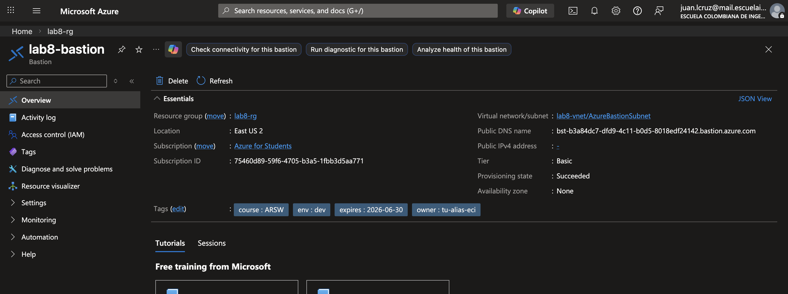

### Reto 2 — Azure Monitor + Budget Alert
Se implementaron dos tipos de alertas para observabilidad y control de costos.

#### **Alerta de health probe (`azurerm_monitor_metric_alert`):**
- Métrica monitoreada: `DipAvailability` del Load Balancer
- Condición: se dispara si menos del 50% de las VMs responden al health probe
- Frecuencia de evaluación: cada 1 minuto, ventana de 5 minutos
- Severidad: Warning (nivel 2)
- Notificación: email al Action Group `lab8-alerts-ag`

#### **Budget Alert (`azurerm_consumption_budget_resource_group`):**
- Presupuesto mensual: $10 USD sobre el Resource Group `lab8-rg`
- Alerta al **80%** del presupuesto ($8 USD)
- Alerta al **100%** del presupuesto ($10 USD)
- Notificación: email directo sin pasar por Action Group

#### **Verificación en el portal:**
- Monitor → Alert rules → `lab8-lb-probe-alert`
- Cost Management → Budgets → `lab8-budget`

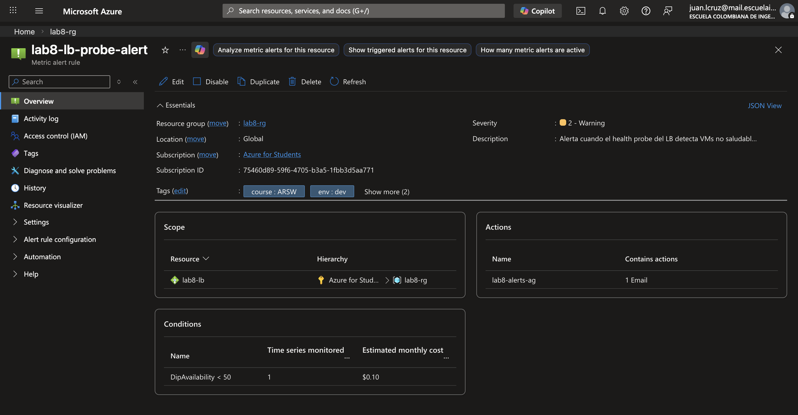
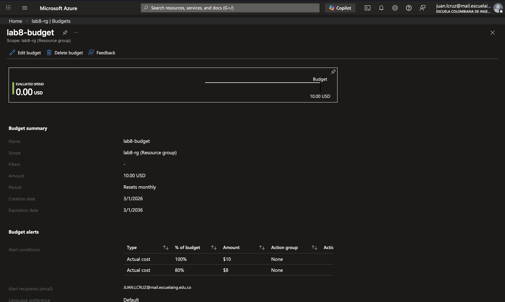